# Recording Trader Desktop

一个功能完整的交易记录桌面应用，支持图片存储、数据分析、复盘模式、学习园、晒单分享图、导出学习 Zip 与完整备份。  
**本仓库仅提供产品介绍与安装包下载**

## 关于

- **界面与初版参考**：基于 Cai_dudu《RT 仪表盘记录.html》
- **桌面版与优化**：jerry（数据持久化、复盘模式、多平台支持及持续体验优化）

## 界面预览

| 仪表盘 | 订单总览 | 复盘模式 |
|--------|----------|----------|
|  | 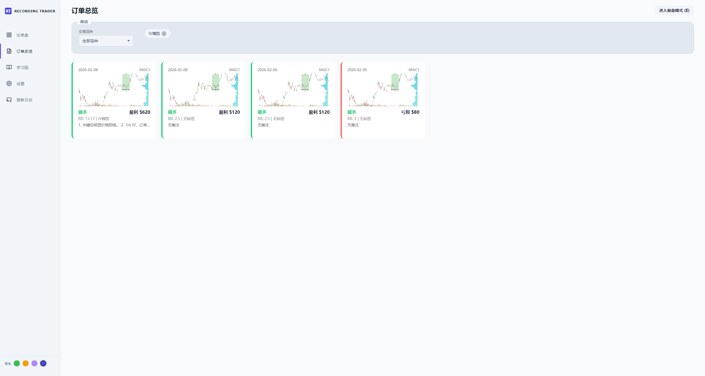 | 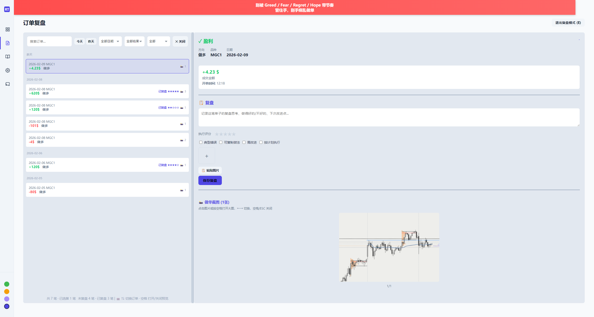 |
| 学习园 | 设置 | 新订单 |
| 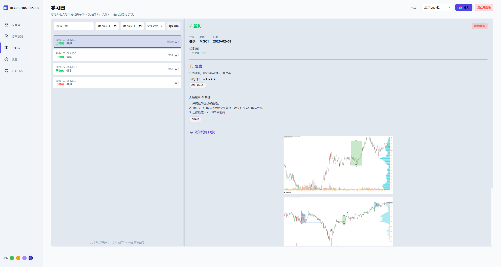 | 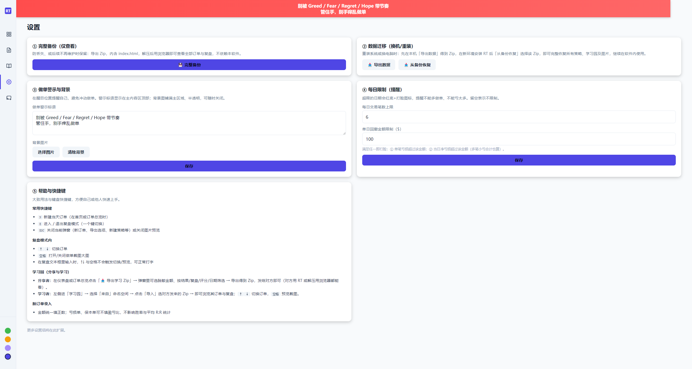 | 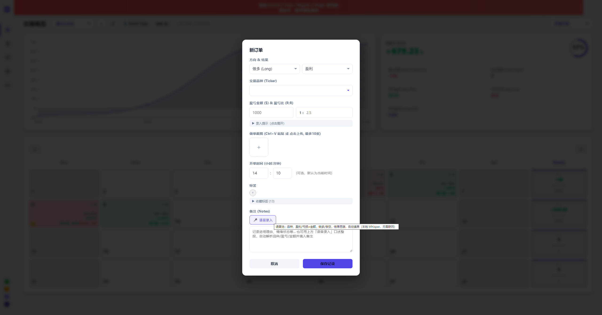 |
| 导出学习 Zip | 图片预览 | 日报告 |
| 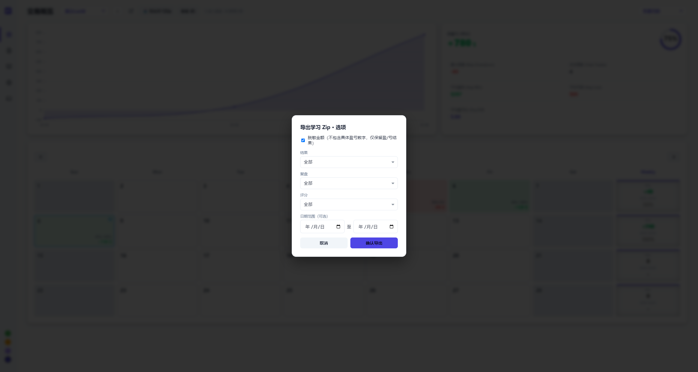 | 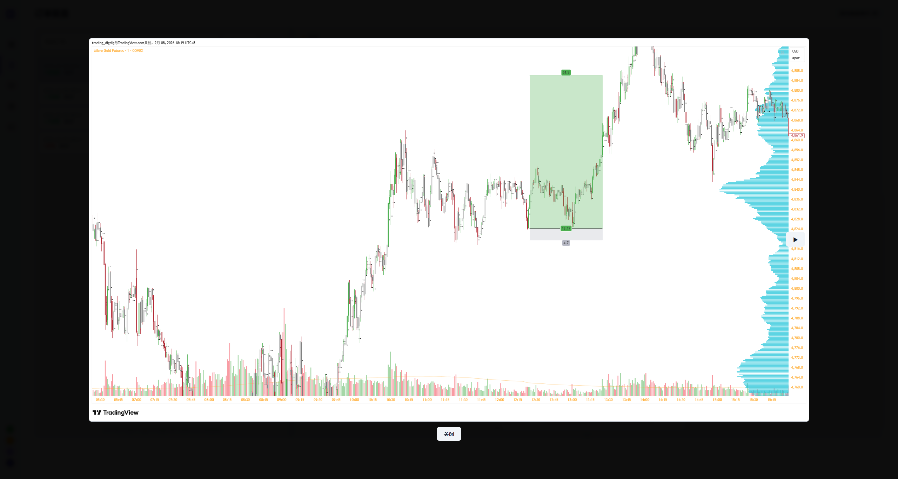 | 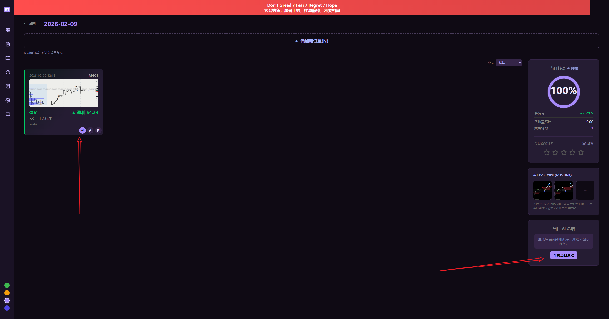 |
| 晒单（卡片入口） | 晒单选项弹窗 | 晒单分享图 |
| 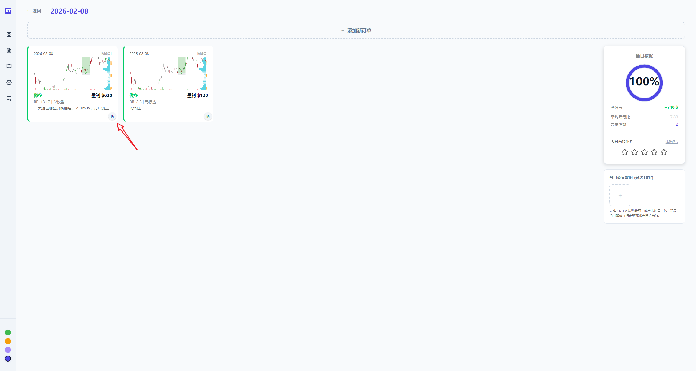 | 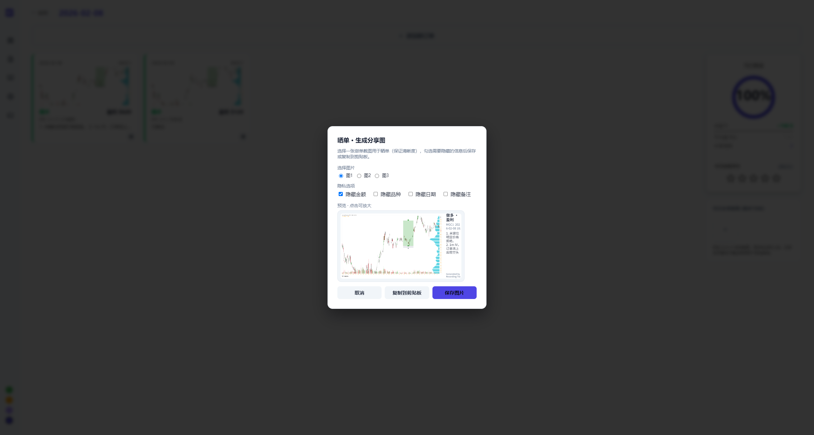 | 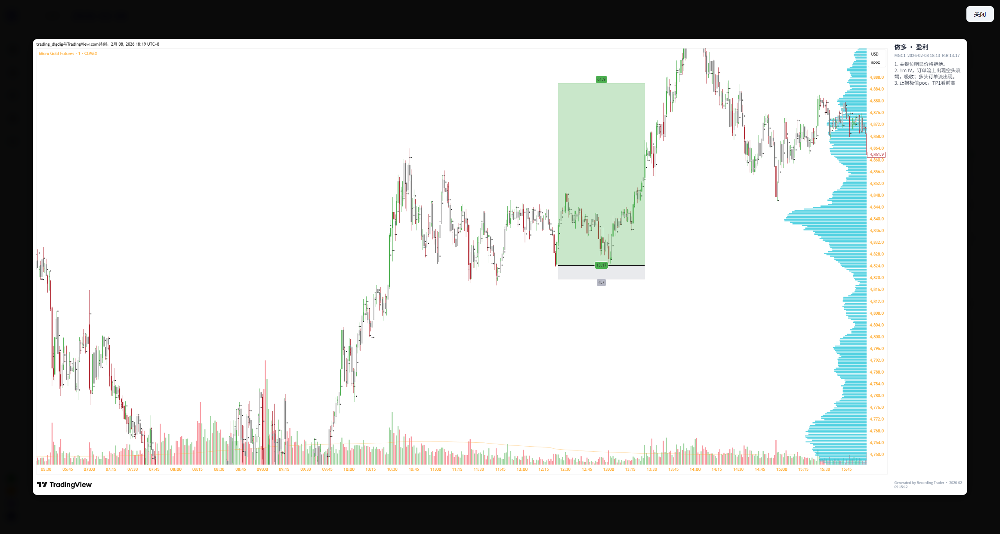 |
| 做单警示与背景（防 FOMO） | 每日笔数/回撤限制 | 日历打脸提醒 |
|  |  |  |
| 语音录入（本地 Whisper） | 语音模型设置 | |
| 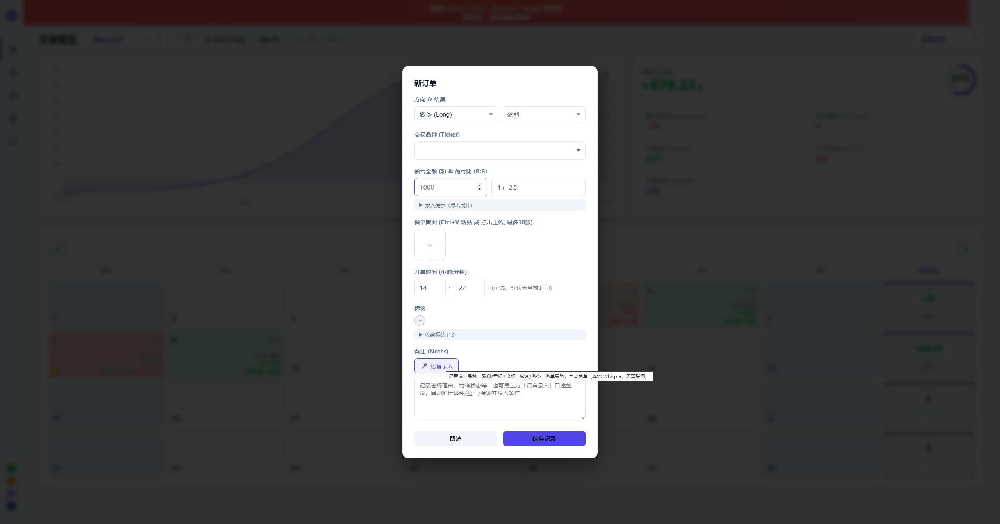 | 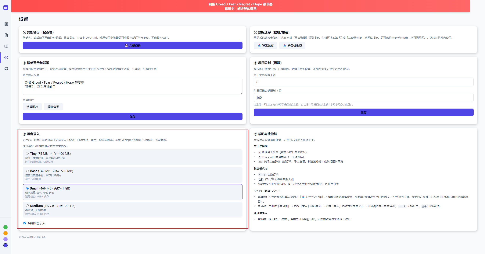 | |

## 下载与安装

### 下载

👉 **[点击这里下载最新版本](https://github.com/0x144169/recording-trader/releases)**  

在 Releases 页面选择与您系统对应的 zip（Windows x64 / Windows ARM64 / macOS Intel / macOS Apple Silicon），下载后解压即可使用，无需安装。

### macOS 用户：如提示「无法验证开发者」无法打开

在 macOS 上首次打开从网上下载的 App 时，可能会提示「无法验证开发者」或「已损坏」。按下面步骤用终端解除限制即可（只需做一次）：

1. **打开「终端」**  
   - 按 `Command + 空格` 打开 Spotlight，输入 **终端** 或 **Terminal**，回车；  
   - 或：打开 **访达** → 左侧点 **应用程序** → 进入 **实用工具** → 双击 **终端**。

2. **在终端里输入下面这行命令（先不要回车）：**  
   ```bash
   sudo xattr -rd com.apple.quarantine 
   ```  
   注意：`com.apple.quarantine` 后面有一个**空格**，先保留，不要删。

3. **把本应用的「应用本身」拖进终端窗口**  
   - 找到你解压后的 **Recording Trader.app**；  
   - 用鼠标**拖拽这个 .app 图标**到终端窗口里，松手后终端会自动补全路径。

4. **回车执行**  
   - 按 **回车**，若提示输入密码，输入你 Mac 的**登录密码**（输入时不会显示字符，输完直接回车即可）。

5. **再双击打开 .app**  
   - 此时再双击 **Recording Trader.app** 即可正常打开。

## 数据存储位置

所有交易记录、截图、数据自动保存在本地：

- **Windows**：`C:\Users\{你的用户名}\AppData\Roaming\recording-trader\`
- **macOS**：`~/Library/Application Support/recording-trader/`

目录内包含交易数据 JSON、策略与品种配置、以及 `images/` 截图文件夹，便于备份或迁移。

## 核心功能

- 📊 **交易记录** - 记录方向、结果、金额、盈亏比
- 📸 **截图管理** - 每笔交易最多 10 张做单截图 + 每日最多 10 张全景截图
- 📈 **数据分析** - 胜率、平均盈亏、最大回撤、盈亏比统计
- 📅 **日历与日报告** - 交易日历、当日笔记/对比图/星级评分
- 🏷️ **标签系统** - 交易标签、收藏标签快速添加
- 📋 **复盘模式** - 日期/结果筛选、心理短板标签（贪婪/恐惧/后悔/侥幸）、进度条与分组列表
- 📤 **导出学习 Zip** - 导出订单+复盘+图片（可脱敏、筛选），供他人导入学习园
- 🖼️ **晒单** - 选一张做单图生成宽幅分享图（可隐藏金额等）；图片预览支持滚轮缩放、拖动平移，方便查看 K 线细节
- 💾 **完整备份与恢复** - 导出全部策略为 Zip（含独立查看器），支持从备份恢复
- 🛡️ **做单警示与限制** - 警示标语与背景图防 FOMO；每日笔数/回撤限制与日历打脸提醒
- 🎤 **语音录入** - 本地 Whisper 语音识别，无需联网；口述做单思路自动填入备注，可解析品种/方向/金额

## 使用示例

### 添加交易
1. 点击 **"+ 新订单"**
2. 选择 **方向**（做多/做空）和 **结果**（盈利/亏损）
3. 输入 **金额** 和 **盈亏比** (R:R)
4. **上传截图**（支持 Ctrl+V 粘贴或点击加号）
5. 添加 **标签** 和 **备注**，**保存**

### 每日回顾
1. 从日历上点击对应日期
2. 查看当日交易，上传 **当日全景截图**（最多 10 张）
3. 给自己 **打分**（1–5 星），系统自动计算当日统计

### 复盘
1. 进入 **订单总览** → 点击 **进入复盘模式**
2. 用 **日期 / 结果 / 未写复盘** 筛选，在右侧写复盘笔记、执行评分、打 **心理短板**（贪婪/恐惧/后悔/侥幸）
3. 点 **保存复盘**

### 导出与备份
- **导出学习 Zip**：仪表盘 **📤 导出学习 Zip**，可选脱敏与筛选，得到 Zip 供他人导入学习园。
- **完整备份**：**设置** → 数据与备份 → **导出数据**，得到含全部策略与查看器的 Zip，可「从备份恢复」。

## 常见问题

**Q: 数据存在哪里？**  
A: 见上方「数据存储位置」，所有数据在本地，不上传云端。

**Q: 如何备份？**  
A: 复制整个 `recording-trader` 目录即可；或使用设置中的「导出数据」得到 Zip。

**Q: 换电脑怎么办？**  
A: 将 `recording-trader` 目录拷贝到新电脑对应路径，或在新电脑上使用「从备份恢复」导入导出的 Zip。

## 隐私与安全

- 所有数据存储在本地，不上传任何云服务
- 支持完整备份与「导出学习 Zip」分享，数据均在您掌控
- 本软件为闭源产品，仅提供编译版下载；安装包由 GitHub Actions 构建并发布至本仓库 Releases

---

**下载最新版：** [Releases](https://github.com/0x144169/recording-trader/releases)  
**Credits:** © 基于 Cai_dudu《RT 仪表盘记录.html》 · jerry 桌面版与优化
